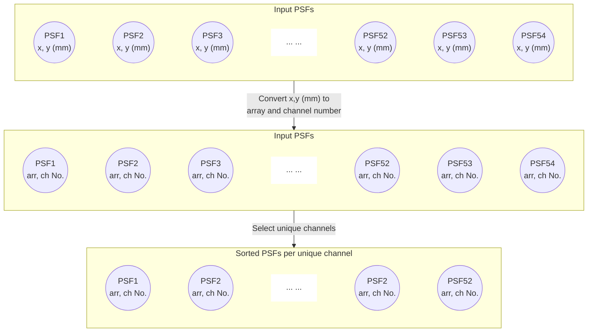

# PSF Averaging Workflow

Create effective PSFs for all SPHEREx fiducial channels used to perform photometry. Assume that hundreds of exposures in the deep field NEP region smooth out PSFs azimuthally very well so that our effective, symmetrical PSFs are a good approximation. 

---
__Workflow__:

